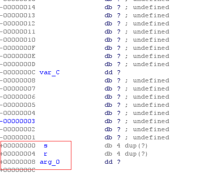

# bof
原题说明  
>Nana told me that buffer overflow is one of the most common software vulnerability.  
Is that true?  
Download : [http://pwnable.kr/bin/bof](http://pwnable.kr/bin/bof)  
Download : [http://pwnable.kr/bin/bof.c](http://pwnable.kr/bin/bof.c)  
Running at : nc pwnable.kr 9000  

# 题解
通过读源码可得知，gets存在一个缓冲区溢出漏洞，它会不停地向内存写入数据直到读到\n，源代码下面有个判断，判断第一个参数是否为`0xcafebabe`，现在只需想办法修改第一个参数为`0xcafebabe`即可拿到flag  
把程序丢进ida后查看func的栈可以查看到该函数的局部变量分布情况  
   
 注：由于屏幕问题，截图不够大，在上面的`00000002C`处标有s  

 首先，传递的参数以及局部变量都是储存在栈中的，由图可知，数组s的范围为2C到C，剩下的C到0为canary(暂不讨论)  
 图中的
 s也就是0到4为ebp  
 r也就是4到8为return的地址  
 arg_0为第一个参数，也就是我们修改的目标  
 当gets读取时会从2c开始写入，经过计算，s到arg_0一共有2c + 8一共52字节，由此可以构造exp  
 注:exp见exp.py  
 之后执行命令  
 ```bash
 ./exp.py
 (cat exp;cat)|nc pwnable.kr 9000
 ```
 即可获取shell  
 之后`cat flag`拿到flag 
 注:|表示管道符，会执行左边的代码作为右边代码的输入，单独的cat命令会输出当前输入的命令，所以执行该指令可以获取shell  
 