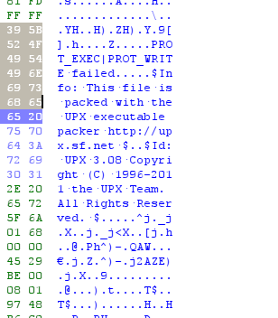
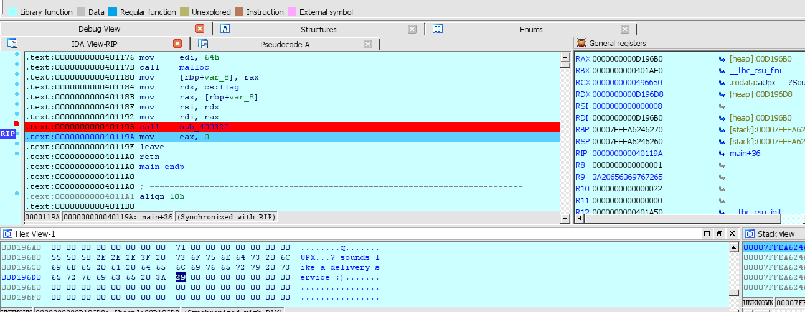

# bof
原题说明  
>Papa brought me a packed present! let's open it.  
Download : http://pwnable.kr/bin/flag  
This is reversing task. all you need is binary  

# 题解
恩，这玩意是一个逆向题
拿到题目后丢ida后f5发现代码有被混淆的迹象，查看hex发现如下信息  
  
得知为upx加壳  
安装upx后，在bash中输入
```bash
upx -d -o flag_unpack flag
```
生成了脱壳后的文件`flag__unpack`  
丢入ida后f5看到提示`I will malloc() and strcpy the flag there. take it.`  
于是在`return 0`前下断点，调试后查看rax的内存地址看到flag   
`UPX...? sounds like a delivery service :)`  
  